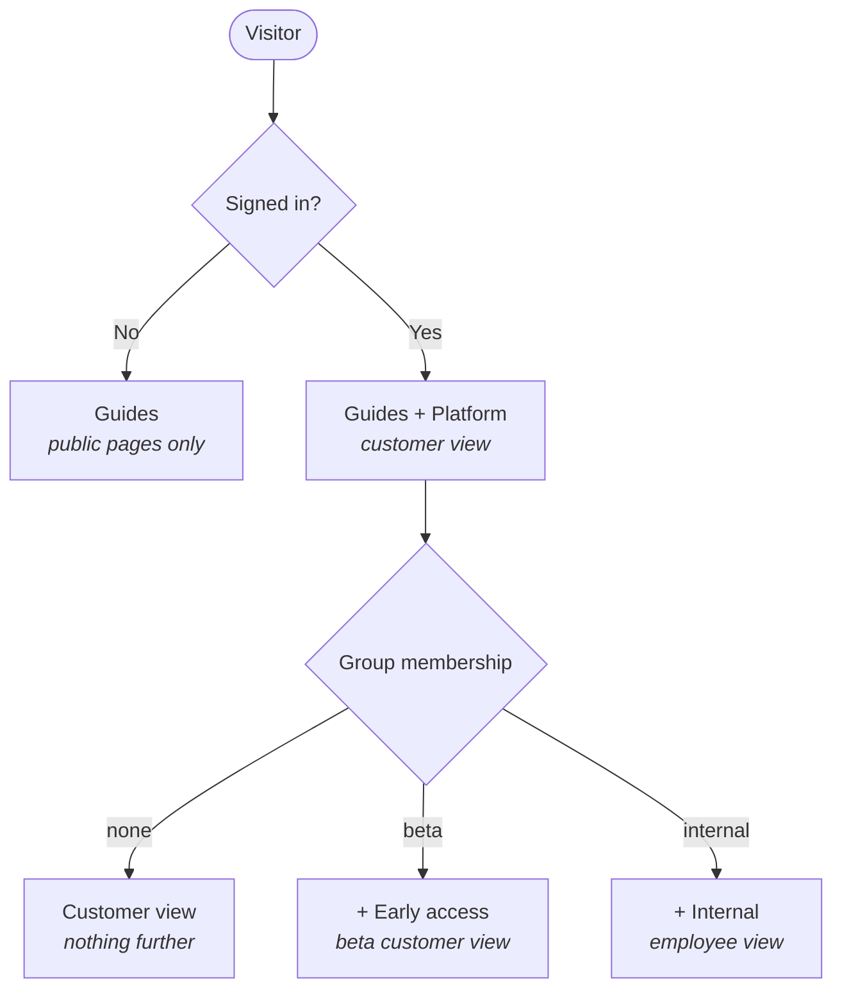

This site uses authentication, which means every page requires a login **by default**.
Pages become readable without one only when you explicitly say so.

<Note>
  You are signed in, which is why this page loaded. An anonymous visitor sees only the
  Guides section - the public tier described below.
</Note>

This guide covers how each audience gets its own view, and how to verify your work before
publishing.

## Who sees what

Access is cumulative from the top, but the two groups are siblings rather than a ladder.
Everyone starts with the public pages; signing in adds the customer view; group membership
adds one further section each.



| Audience | Guides | Platform | Early access | Internal |
| --- | :---: | :---: | :---: | :---: |
| Anonymous | Yes | - | - | - |
| Signed in | Yes | Yes | - | - |
| Signed in, `beta` | Yes | Yes | Yes | - |
| Signed in, `internal` | Yes | Yes | - | Yes |
| Signed in, both groups | Yes | Yes | Yes | Yes |

<Note>
  Membership of `internal` does not imply membership of `beta`. A page listing
  `groups: ["beta"]` is visible only to users whose group list contains `beta`, so an
  employee who should also see beta content needs both groups, or the page needs to list
  both. Groups are a set membership test, not a privilege level.
</Note>

## The three controls

There are only three, and they compose predictably.

| Control | Where it lives | Scope |
| --- | --- | --- |
| Site is private | Mintlify dashboard | whole site |
| `public: true` | `docs.json` group, or page frontmatter | group or page |
| `groups: [...]` | page frontmatter | page |

## How a page resolves

| Frontmatter | Logged out | Logged in, wrong group | Logged in, right group |
| --- | --- | --- | --- |
| *(nothing)* | redirect to login | visible | visible |
| `public: true` | visible | visible | visible |
| `groups: ["beta"]` | redirect to login | **404** | visible |

The rules, verbatim from Mintlify's documentation:

- All pages require authentication by default.
- Pages with a `groups` property are only accessible to authenticated users in those groups.
- Pages without a `groups` property are accessible to all authenticated users.
- Pages with `public: true` and no `groups` property are accessible to everyone.

<Note>
  Never combine `public: true` with `groups`. Public access applies only when there is no
  `groups` property, so the combination is ambiguous. Pick one.
</Note>

## Configure each tier

### Public

Mark the group in `docs.json`. One line covers every page in it.

```json docs.json
{
  "group": "Getting started",
  "public": true,
  "pages": ["index", "quickstart"]
}
```

### Logged-in only

Do nothing. The absence of a flag is the configuration — pages inherit the site-wide
default, which is "login required".

```mdx platform/overview.mdx
---
title: "Platform overview"
description: "How the platform fits together"
---
```

### A specific group

Add `groups` to the page's frontmatter.

```mdx internal/runbook.mdx
---
title: "On-call runbook"
groups: ["internal"]
---
```

Group membership comes from your identity provider, not from Mintlify. Only OAuth and JWT
authentication return it — password and Mintlify-managed private authentication do not.

## Preview before publishing

Mock any audience locally. No auth provider or auth server required.

```bash
mint dev                      # the default logged-in view
mint dev --groups beta        # as a beta customer
mint dev --groups internal    # as an employee
```

Confirm the mock took effect — the CLI prints it on startup:

```
Development Mode: Using mock user groups: [ 'internal' ]
```

<Warning>
  If `--groups` appears to do nothing, the mock file went stale. Stop the server, delete
  `~/.mintlify/previews/<port>/mint/apps/client/src/_props/dev-groups.json`, and restart.
</Warning>

## Two failure modes, on purpose

| Tier | Unauthorized response | What it reveals |
| --- | --- | --- |
| Logged-in only | `307` redirect to login | the page exists; go authenticate |
| Group-gated | `404` | nothing at all |

The 404 is deliberate. A `403 Forbidden` would confirm that a restricted page exists, which
is itself a disclosure. A 404 is indistinguishable from a URL that was never real.

## Related

- [Authentication setup](https://www.mintlify.com/docs/deploy/authentication-setup)
- [Partial authentication](https://mintlify.com/docs/settings/authentication-personalization/partial-authentication)
- [Preview locally](https://www.mintlify.com/docs/cli/preview)
